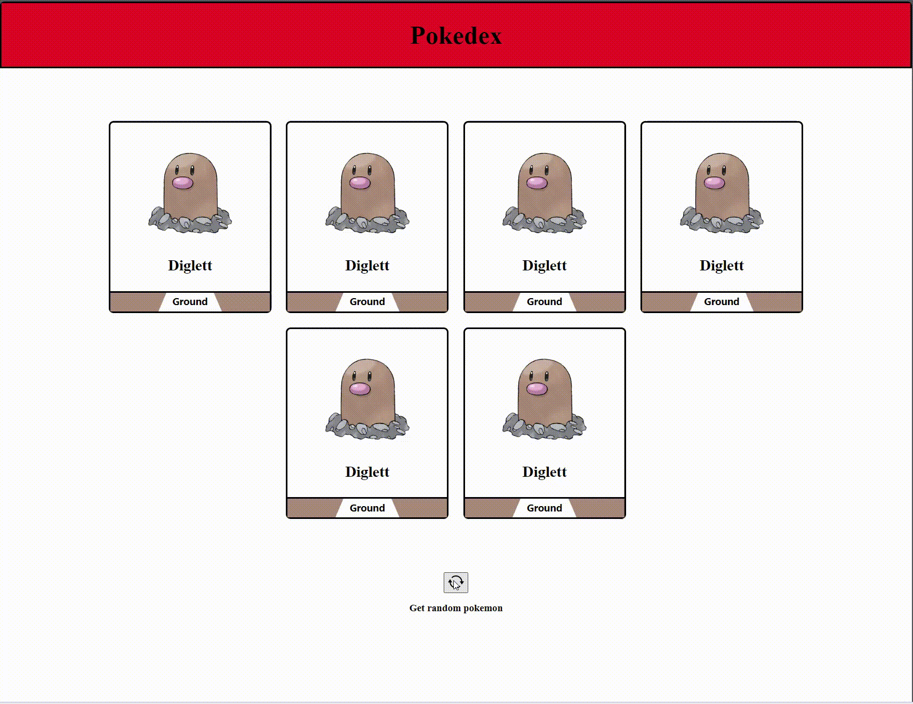

# .Net Web API

## Assignment: JokeView + Pokedex

#### Overview
In this assignment, you will configure two different webpages written in React to request data from an api written in C# and .Net. You will use the response data from the API to update the page with new information.

<div style="display: flex; flex-direction: column; justify-content: center;  align-items: center;
">  <div>
    <h1 style="margin-right: 1%; margin-top: 1%; text-align:center; margin-bottom: 0px;" >Part 1: JokeView</h1>
   <h3 style="text-align: center; margin-top: 0px;">API Endpoint: <a href="http://localhost:5142/random_joke">http://localhost:5142/random_joke</a></h3>

    
   <h1 style="margin-right: 1%; margin-top: 1%; text-align:center" >Part 2: PokeDex</h1>
   <h3 style="text-align: center; margin-top: 0px;">API Endpoint: <a href="http://localhost:5142/pokemon">http://localhost:5142/pokemon</a></h3>
   
  </div>
</div>

#### Setup and Install:
```bash

#install the dependencies for the project
cd ./server && dotnet restore

cd ./jokeview && npm install

cd ./pokedex && npm install


```
#### Example Usage
```bash
#start the server
cd server && dotnet run

#start one of clients
cd jokeview && npm start
```


### Instructions


### **Part 1: JokeView **
http://localhost:5142/random_joke
<details>

<summary>Preview</summary>


</details>
<br>


1. When a user clicks the "Refresh Joke" button, fetch a random joke from the Jokes API and replace the current joke on the page with a new joke

    <br>

    - Fix the bug in the api that causes the /random_joke enpoint to return the same joke everytime.

    <br>


<br>


### **Part 2: Pokedex **
http://localhost:5142/pokemon
<details>

<summary>Preview</summary>


</details>
<br>

1. When a user clicks the "Get random pokemon" button, fetch a new batch of pokemon objects from [the random pokemon endpoint](http://localhost:5142/pokemon) and replace the current set of pokemon on the page with the pokemon received from the api

    <br>

    - Create an endpoint in the api that responds with a random set of 6 pokemon objects. The pokemon should be pulled from [the Pokemon.json file](./server/Pokemon.json)
            
    <br>

    - When a user clicks the 'Get random pokemon' button, use the [fetch function](https://www.freecodecamp.org/news/make-api-calls-in-javascript/) to send a HTTP request to [the random pokemon endpoint](http://localhost:5142/pokemon) and update the page with the new array of pokemon objects from [the API](http://localhost:5142/pokemon)

    <br>